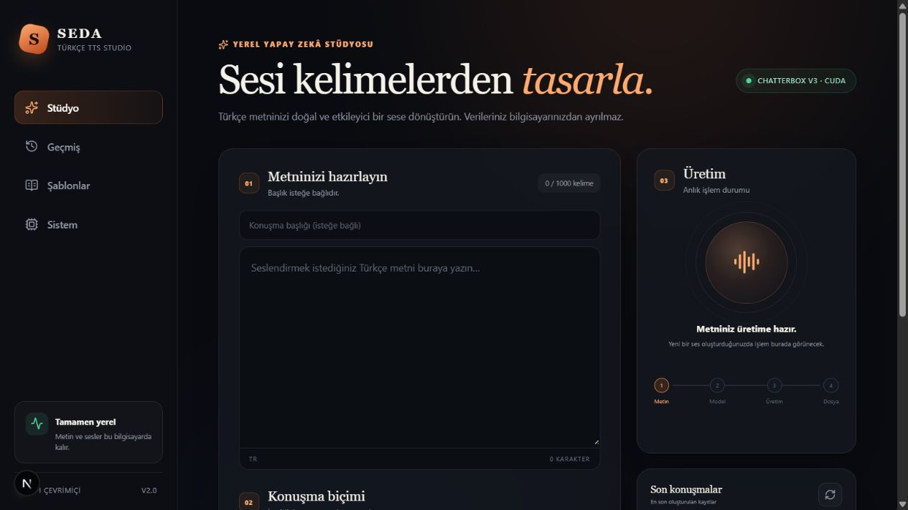
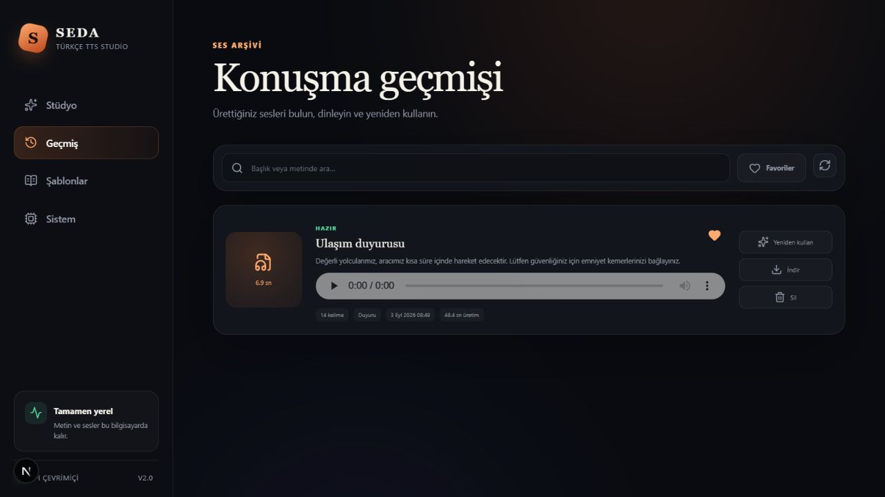

# SEDA — Türkçe TTS Studio

SEDA, Türkçe metinleri yerel bilgisayarda yapay zekâ ile seslendiren bir staj
projesidir. Arayüz Next.js ile, API Python ve FastAPI ile hazırlanmıştır. Ses
üretiminde Chatterbox Multilingual V3 ve NVIDIA CUDA kullanılır. Oluşturulan
konuşmalar SQLite veritabanında saklanır.





## Projenin amacı

İlk sürüm yalnızca metin girip WAV dosyası oluşturan bir Gradio uygulamasıydı.
Staj projesinin yazılım geliştirme tarafını güçlendirmek için proje daha sonra
web uygulamasına dönüştürüldü. Böylece yalnızca bir yapay zekâ modeli çalıştırmak
yerine arayüz, REST API, veritabanı, arka plan kuyruğu ve testlerden oluşan küçük
bir sistem geliştirildi.

Bu projede TTS modeli sıfırdan eğitilmemiştir. Hazır model uygulamaya entegre
edilmiş; metin işleme, GPU kullanımı, işlem takibi, kayıt yönetimi ve arayüz
tarafları geliştirilmiştir.

## Özellikler

- En fazla 1000 kelimelik Türkçe metin girişi ve anlık kelime sayacı
- Chatterbox Multilingual V3 ile 24 kHz mono WAV üretimi
- NVIDIA CUDA ile GPU hızlandırma
- Doğal, haber, duyuru, hikâye, eğitim ve erişilebilirlik konuşma biçimleri
- Duygu, metne bağlılık ve yaratıcılık için gelişmiş ayarlar
- Model yükleme, parça üretimi ve dosya kaydetme aşamalarını canlı gösterme
- Aynı anda gelen işleri tek GPU kuyruğunda sırayla çalıştırma
- SQLite tabanlı konuşma geçmişi
- Geçmişte arama, favorileme, yeniden kullanma, indirme ve silme
- Hazır metin şablonları
- GPU, CUDA, model belleği ve üretim istatistikleri ekranı
- Masaüstü ve mobil ekranlara uyumlu arayüz
- Verilerin ve ses dosyalarının tamamen yerel bilgisayarda kalması

## Mimari

```text
Tarayıcı
   │
   ▼
Next.js + React arayüzü (port 3000)
   │  HTTP / JSON
   ▼
FastAPI REST API (port 8000)
   ├── SQLite konuşma geçmişi
   └── Tek işçili üretim kuyruğu
          │
          ▼
     Metin parçalama
          │
          ▼
Chatterbox V3 + PyTorch + CUDA
          │
          ▼
      outputs/*.wav
```

Mimari özellikle anlaşılır tutulmuştur. Veritabanında ORM yerine Python'ın
`sqlite3` modülü, canlı durum için WebSocket yerine kısa aralıklarla REST sorgusu
ve GPU işleri için tek bir arka plan iş parçacığı kullanılır.

## Kullanılan teknolojiler

| Bölüm | Teknoloji |
|---|---|
| Web arayüzü | Next.js 16, React 19, TypeScript, CSS |
| Arka uç | Python 3.10, FastAPI, Uvicorn |
| Veritabanı | SQLite |
| Yapay zekâ | Chatterbox Multilingual V3 |
| GPU | PyTorch 2.6, CUDA 12.4 |
| Ses dosyası | NumPy, SoundFile, PCM-16 WAV |
| Test | Python unittest, FastAPI TestClient, ESLint, TypeScript |

## Sayfalar

- **Stüdyo:** Metin, başlık ve konuşma biçimi seçilir; üretim durumu izlenir ve
  sonuç dinlenir.
- **Geçmiş:** Eski konuşmalar aranır, favorilenir, tekrar kullanılır, indirilir
  veya silinir.
- **Şablonlar:** Ulaşım duyurusu, haber girişi ve eğitim anlatımı gibi örnek
  metinler stüdyoya aktarılır.
- **Sistem:** GPU adı, CUDA durumu, model belleği, kuyruk ve yerel üretim
  istatistikleri gösterilir.

## Üretim akışı

1. Arayüz metni ve seçilen konuşma ayarlarını API'ye gönderir.
2. API boş metin ve 1000 kelime sınırı kontrolü yapar.
3. İş SQLite'a `queued` durumuyla kaydedilir ve üretim kuyruğuna eklenir.
4. Arka plan işçisi metni, kelimeleri bozmadan güvenli uzunlukta parçalara ayırır.
5. Chatterbox modeli ilk üretimde GPU belleğine yüklenir.
6. Parçalar Türkçe dil kimliğiyle sırayla seslendirilir ve aralarına kısa
   sessizlik eklenir.
7. Birleştirilen ses PCM-16 WAV olarak `outputs` klasörüne kaydedilir.
8. Veritabanı süre ve dosya bilgileriyle güncellenir. Arayüz işlem boyunca kayıt
   durumunu yaklaşık saniyede bir sorgular.

## Önemli dosyalar

| Yol | Görevi |
|---|---|
| `frontend/app/` | Next.js sayfaları, genel düzen ve stiller |
| `frontend/components/` | Stüdyo, geçmiş, şablon ve sistem bileşenleri |
| `frontend/lib/api.ts` | Arayüzün FastAPI ile yaptığı HTTP istekleri |
| `backend/main.py` | API uçları, doğrulama ve CORS ayarları |
| `backend/database.py` | SQLite tablo ve konuşma geçmişi işlemleri |
| `backend/jobs.py` | Tek işçili arka plan üretim kuyruğu |
| `backend/presets.py` | Konuşma biçimleri ve hazır metin şablonları |
| `tts_service.py` | Model yükleme, CUDA seçimi, üretim ve WAV kaydı |
| `text_utils.py` | Metin temizleme, kelime sayma ve parçalama |
| `tests/` | Model indirmeden çalışan birim ve API testleri |
| `start.ps1`, `stop.ps1` | Yerel uygulamayı tek komutla açma ve kapatma |

## Sistem gereksinimleri

- Windows 10 veya 11
- Python 3.10
- Node.js 20 veya daha yeni bir sürüm
- pnpm 11
- Güncel NVIDIA ekran kartı sürücüsü
- Önerilen en az 6 GB NVIDIA GPU belleği
- Model ve paketler için yaklaşık 8 GB boş disk alanı
- İlk kurulum ve ilk model indirmesi sırasında internet bağlantısı

Kod CPU'yu da seçebilir fakat proje RTX 3060 Laptop GPU üzerinde test edilmiştir.
CPU ile üretim belirgin biçimde daha yavaştır.

## Kurulum

PowerShell'i proje klasöründe açın.

### 1. Python ve CUDA paketleri

```powershell
py -3.10 -m venv venv
.\venv\Scripts\python.exe -m pip install --upgrade pip
.\venv\Scripts\python.exe -m pip install -r requirements-cuda.txt
```

CUDA kontrolü:

```powershell
.\venv\Scripts\python.exe -c "import torch; print(torch.__version__); print(torch.cuda.is_available()); print(torch.cuda.get_device_name(0))"
```

İkinci satırın `True`, üçüncü satırın NVIDIA ekran kartı adı olması beklenir.

### 2. Web arayüzü paketleri

```powershell
corepack enable
cd frontend
pnpm install --frozen-lockfile
cd ..
```

## Çalıştırma

İki uygulamayı birlikte başlatmak için:

```powershell
.\start.ps1
```

Arayüz: `http://127.0.0.1:3000`

FastAPI belgeleri: `http://127.0.0.1:8000/docs`

Uygulamayı kapatıp modeli GPU belleğinden çıkarmak için:

```powershell
.\stop.ps1
```

İlk ses üretiminde model proje içindeki `.cache/huggingface` klasörüne indirilir.
Daha sonraki açılışlarda aynı yerel önbellek kullanılır.

### Elle geliştirme modu

Gerekirse iki ayrı PowerShell penceresinde şu komutlar çalıştırılabilir:

```powershell
.\venv\Scripts\python.exe -m uvicorn backend.main:app --host 127.0.0.1 --port 8000
```

```powershell
cd frontend
pnpm dev
```

## API özeti

| Yöntem ve yol | İşlem |
|---|---|
| `GET /api/health` | API sağlık kontrolü |
| `GET /api/system` | GPU, model ve istatistik bilgileri |
| `GET /api/presets` | Konuşma biçimleri |
| `GET /api/templates` | Hazır metin şablonları |
| `POST /api/generations` | Yeni ses üretimini kuyruğa ekleme |
| `GET /api/generations` | Geçmişi listeleme ve arama |
| `GET /api/generations/{id}` | Canlı işlem durumunu alma |
| `PATCH /api/generations/{id}/favorite` | Favori durumunu değiştirme |
| `GET /api/generations/{id}/audio` | WAV dosyasını indirme |
| `DELETE /api/generations/{id}` | Tamamlanmış kaydı ve WAV dosyasını silme |

## Testler

Python testleri gerçek modeli yüklemeden metin, servis, SQLite, API ve üretim
kuyruğunu sınar:

```powershell
.\venv\Scripts\python.exe -m unittest discover -s tests -v
.\venv\Scripts\python.exe -m pip check
```

Frontend kontrolleri:

```powershell
cd frontend
pnpm lint
pnpm build
```

Gerçek model ve GPU testi:

```powershell
.\venv\Scripts\python.exe test_chatterbox.py
```

3 Eylül 2026 tarihinde yapılan son kontrolde 15 Python testinin tamamı, ESLint,
TypeScript ve Next.js üretim derlemesi geçmiştir. RTX 3060 Laptop GPU ile gerçek
arayüzden 6,9 saniyelik örnek WAV başarıyla oluşturulmuş ve geçmişe kaydedilmiştir.
`requirements-cuda.txt` ayrıca boş bir sanal ortama sıfırdan kurulmuş; aynı testler,
bağımlılık kontrolü ve CUDA algılama işlemi bu temiz ortamda da geçmiştir.

## Neden Freya yerine Chatterbox?

İlk denemede Freya-TTS teknik olarak ses üretti ancak Türkçe telaffuz ve doğallık
yeterli bulunmadı. Aynı örnek metinler Chatterbox Multilingual V3 ile dinlendi.
Chatterbox çıktısı daha anlaşılır olduğu için son sürümde bu model seçildi.

## Neden Gradio yerine Next.js?

Gradio, modelin çalıştığını hızlıca göstermek için yararlıydı fakat proje yalnızca
bir metin kutusu ve düğmeden oluşuyordu. Next.js ve FastAPI ayrımıyla geçmiş,
şablon, ayar, sistem bilgisi ve API katmanları eklenebildi. Eski Gradio sürümü Git
geçmişinde korunur; güncel uygulamanın arayüzü Next.js'tir.

## Karşılaşılan sorunlar

### Windows Smart App Control

Bazı yeni Numba ve Pydantic Core derlemeleri Windows tarafından engellendi.
Windows güvenliğini kapatmak yerine bu bilgisayarda imzası kabul edilerek çalışan
Numba, llvmlite, Pydantic ve Pydantic Core sürümleri sabitlendi.

### CUDA paket uyumu

PyTorch ve torchaudio aynı CUDA 12.4 sürümünde sabitlendi. Böylece yanlışlıkla CPU
paketi kurulması ve iki paketin sürümlerinin ayrışması önlendi.

### Model önbelleği

Farklı uygulamaların Hugging Face ayarları modelin bulunmasını etkileyebiliyordu.
Bu proje kendi `.cache/huggingface` klasörünü kullanacak şekilde ayarlandı.

### GPU'da aynı anda birden fazla iş

Birden fazla üretimin aynı anda başlaması GPU belleğini aşabilir. Bu nedenle
istekler basit bir kuyruğa alınır ve tek işçi tarafından sırayla tamamlanır.

## Bilinen sınırlamalar

- Uygulama yerel kullanım içindir; kullanıcı hesabı ve internet yayını yoktur.
- Tek GPU işçisi kullandığı için ikinci istek ilk isteğin bitmesini bekler.
- SQLite tek bilgisayarlı kullanım için uygundur; çok kullanıcılı sunucu hedeflenmez.
- Konuşma biçimleri model ayarlarını değiştirir fakat her metinde sonuç aynı ölçüde
  belirgin olmayabilir.
- Hazır model kullanılır; model eğitimi ve ses klonlama proje kapsamı dışındadır.

## Yapay zekâ desteğinin kapsamı

Geliştirme sırasında üretken yapay zekâdan araştırma, kod önerileri, hata çözme ve
test senaryoları hazırlama konularında yardım alınmıştır. Gereksinimlerin seçilmesi,
seslerin dinlenerek değerlendirilmesi, model değişikliği kararı ve yerel bilgisayar
üzerindeki doğrulamalar proje çalışmasının parçasıdır. Sunumda hazır Chatterbox
modeli kullanıldığı ve modelin sıfırdan eğitilmediği açıkça belirtilmelidir.
