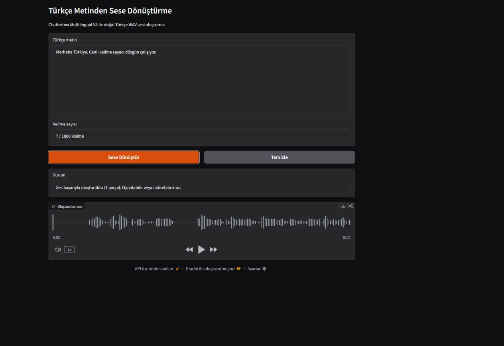

# Türkçe Metinden Sese Dönüştürme

Python, Gradio ve **Chatterbox Multilingual V3** kullanarak Türkçe metinleri
yerel bilgisayarda sese dönüştüren, NVIDIA CUDA hızlandırmalı bir staj projesi.
Girilen metin doğrulanır, uzun metinler uygun parçalara ayrılır, parçalar sırayla
seslendirilir ve tek bir WAV dosyasında birleştirilir.



## Özellikler

- En fazla 1000 kelimelik Türkçe metin girişi
- Yazım sırasında güncellenen kelime sayacı
- Boş metin ve kelime sınırı doğrulaması
- Cümleleri koruyarak 300–500 karakterlik parçalara ayırma
- Parçalar arasına 250 milisaniye sessizlik ekleme
- Chatterbox Multilingual V3 ile Türkçe (`tr`) ses üretimi
- CUDA varsa otomatik GPU, yoksa CPU seçimi
- Modeli uygulama ömrü boyunca yalnızca bir kez yükleme
- Üretim aşamalarını arayüzde canlı gösterme
- Tarih ve saat içeren 24 kHz mono WAV çıktısı
- Arayüzden sesi oynatma ve indirme

## Mimari

```text
Kullanıcı / Gradio arayüzü (app.py)
                 │
                 ▼
Metin doğrulama ve parçalama (text_utils.py)
                 │
                 ▼
Model yönetimi ve ses üretimi (tts_service.py)
                 │
                 ▼
Chatterbox V3 + PyTorch + CUDA
                 │
                 ▼
      outputs/tts_TARİH_SAAT.wav
```

Uygulamanın arayüzü, metin işleme kodu ve model kodu ayrı dosyalarda tutulur.
Bu ayrım her parçanın tek bir sorumluluğa sahip olmasını ve model yüklemeden
metin fonksiyonlarının test edilebilmesini sağlar.

## Dosyaların görevleri

| Dosya | Görevi |
|---|---|
| `app.py` | Gradio bileşenlerini oluşturur, dönüştürme işini başlatır ve canlı durum mesajlarını gösterir. |
| `tts_service.py` | CUDA/CPU seçimi, modelin tembel yüklenmesi, ses üretimi, parçaların birleştirilmesi ve WAV kaydını yönetir. |
| `text_utils.py` | Metni temizler, kelime sayısını doğrular, cümlelere ve güvenli uzunluktaki parçalara ayırır. |
| `test_chatterbox.py` | Gerçek Chatterbox modeli ve GPU ile uçtan uca ses üretim testi yapar. |
| `tests/` | Model indirmeden çalışan metin, servis ve canlı durum birim testlerini içerir. |
| `requirements.txt` | Uygulama ve Chatterbox bağımlılıklarını sabitler. |
| `requirements-cuda.txt` | CUDA 12.4 uyumlu PyTorch paketlerini ve temel gereksinimleri kurar. |
| `outputs/` | Oluşturulan WAV dosyalarının kaydedildiği klasördür. |

## İşlem akışı

1. Kullanıcı Türkçe metni girer ve **Sese Dönüştür** düğmesine basar.
2. Fazla boşluklar temizlenir; boş giriş ve 1000 kelime sınırı kontrol edilir.
3. Metin önce `.`, `!` ve `?` işaretlerine göre cümlelere ayrılır.
4. Cümleler, kelimeler bölünmeden en fazla 500 karakterlik parçalara dönüştürülür.
5. Chatterbox modeli ilk istekte yüklenir ve uygulama açık kaldığı sürece bellekte tutulur.
6. Her parça Türkçe dil kimliğiyle (`tr`) sırayla seslendirilir.
7. Ses parçalarının arasına 250 ms sessizlik eklenir.
8. Birleştirilen ses 24 kHz, mono, PCM-16 WAV dosyası olarak kaydedilir.
9. Dosya Gradio oynatıcısında açılır ve indirilebilir.

Üretim devam ederken durum alanında model yükleme, parça numarası, ses üretimi
ve WAV kaydetme aşamaları canlı olarak gösterilir.

## Neden Freya-TTS yerine Chatterbox?

Projenin ilk sürümünde görev tanımına uygun olarak Freya-TTS denendi. Model
teknik olarak ses üretebilse de yapılan dinleme testlerinde Türkçe telaffuz ve
doğallık proje için yeterli bulunmadı. Bunun üzerine Türkçe dil desteği bulunan
Chatterbox Multilingual V3 ile karşılaştırmalı deneme yapıldı. Chatterbox çıktısı
daha anlaşılır ve doğal bulunduğu için uygulamanın son sürümünde bu model
kullanıldı.

Bu projede model sıfırdan eğitilmemiştir. Hazır modelin çıkarım süreci uygulamaya
entegre edilmiş; metin işleme, GPU kullanımı, çıktı birleştirme, hata yönetimi,
arayüz ve test altyapısı geliştirilmiştir.

## Sistem gereksinimleri

- Windows 10 veya 11
- Python 3.10 (3.11 de desteklenen hedef sürümdür)
- Güncel NVIDIA ekran kartı sürücüsü
- Önerilen: en az 6 GB VRAM bulunan NVIDIA GPU
- İlk model indirmesi için yaklaşık 3 GB boş alan ve internet bağlantısı

Uygulama GPU bulunmadığında CPU cihazını seçebilir. CPU yolu kodda mevcuttur
ancak proje RTX 3060 Laptop GPU üzerinde doğrulanmıştır; CPU üretimi belirgin
şekilde daha yavaş olabilir.

## Kurulum

PowerShell'i proje klasöründe açın:

```powershell
py -3.10 -m venv venv
.\venv\Scripts\Activate.ps1
python -m pip install --upgrade pip
pip install -r requirements-cuda.txt
```

CUDA kurulumunu kontrol edin:

```powershell
python -c "import torch; print(torch.__version__); print(torch.cuda.is_available()); print(torch.cuda.get_device_name(0))"
```

`torch.cuda.is_available()` sonucu `True` olmalıdır. İlk model kullanımında
Chatterbox ağırlıkları proje içindeki `.cache/huggingface` klasörüne indirilir.
Sonraki çalıştırmalarda aynı yerel önbellek kullanılır.

## Kullanım

```powershell
.\venv\Scripts\python.exe app.py
```

Tarayıcıda `http://127.0.0.1:7860` adresini açın. Metni yazın, **Sese
Dönüştür** düğmesine basın ve durum alanındaki aşamaları takip edin. İşlem
tamamlandığında ses oynatılabilir veya WAV olarak indirilebilir.

## Testler

Model indirmeden çalışan birim testleri:

```powershell
.\venv\Scripts\python.exe -m unittest discover -s tests -v
```

Bağımlılık tutarlılığı:

```powershell
.\venv\Scripts\python.exe -m pip check
```

Gerçek model ve GPU ile entegrasyon testi:

```powershell
.\venv\Scripts\python.exe test_chatterbox.py
```

Entegrasyon testi başarılı olduğunda `outputs/chatterbox_v3_test.wav` oluşur.

## Karşılaşılan sorunlar ve çözümler

### Türkçe ses kalitesi

Freya-TTS çalışan bir çıktı üretmesine rağmen Türkçe konuşma kalitesi yeterli
bulunmadı. Farklı bir çok dilli model denenerek Chatterbox V3'e geçildi.

### CUDA uyumluluğu

PyTorch ve torchaudio paketleri aynı CUDA 12.4 sürümü için sabitlendi. Böylece
CPU paketinin yanlışlıkla kurulması ve sürüm uyuşmazlığı önlendi.

### Windows Smart App Control engeli

Numba 0.67 içindeki `_typeconv` ve yeni Pydantic Core 2.46.5 içindeki
`_pydantic_core` modülleri Windows Smart App Control tarafından engellendi.
Windows güvenliği kapatılmadan, bu bilgisayarda çalıştığı doğrulanan Numba,
llvmlite, Pydantic ve Pydantic Core sürümleri sabitlenerek sorun çözüldü.

### Model önbelleği

Sistem genelindeki `HF_HOME` değişkeni uygulamanın indirilmiş modeli bulmasını
engelleyebiliyordu. Uygulama başlangıcında önbellek yolu proje içindeki
`.cache/huggingface` klasörüne sabitlendi.

## Bilinen sınırlamalar

- Ses karakteri ve duygu ayarları arayüzde sunulmamaktadır.
- CPU çalışma yolu otomatik seçilse de performans testi GPU üzerinde yapılmıştır.
- Çok uzun metinlerde toplam üretim süresi parça sayısına bağlı olarak artar.
- Uygulama yerel kullanım için tasarlanmıştır; kullanıcı hesabı veya uzak sunucu dağıtımı içermez.

## Yapay zekâ desteğinin kapsamı

Geliştirme sırasında üretken yapay zekâdan araştırma, kod önerileri, bağımlılık
hatalarını çözme ve test fikirleri için yardım alınmıştır. Model seçimi, seslerin
dinlenerek değerlendirilmesi, gereksinimlerin belirlenmesi ve uygulamanın yerel
GPU üzerinde doğrulanması proje geliştirme sürecinin parçasıdır. Kullanılan hazır
TTS modeli ayrıca açıkça belirtilmiş, modelin sıfırdan eğitildiği iddia edilmemiştir.
